# Jewelry Image Similarity Search — Architecture Document

## 1. System Overview

The jewelry image similarity search system identifies and retrieves visually similar jewelry products from a catalog given a query photograph. It uses a multi-model architecture where each model handles a specific task it is best suited for, rather than relying on a single model for everything.

### Core Design Principles

- **Separation of concerns:** Classification, material detection, and visual similarity are handled by different models.
- **Split processing path:** A single preprocessing pass produces two image variants — each optimized for its downstream model.
- **Hard filters before soft ranking:** Category and material are applied as SQL filters before similarity search, not blended into embeddings.
- **No fine-tuning required:** All models are used as-is with zero-shot capabilities. The system is tenant-agnostic — no per-tenant training or data labeling.
- **On-device background removal:** BiRefNet runs on the client device. The server receives an RGBA image with background already removed.
- **Product-level deduplication:** A product (serial_number) may have multiple images. Search deduplicates to return unique products, not unique images.

### Models Used

| Model | Role | Parameters | Embedding Dim | Input Resolution | Runs On |
|---|---|---|---|---|---|
| BiRefNet | Background removal (on-device) | ~200M | N/A (outputs mask) | 1024 × 1024 | Client device |
| CLIP ViT-L/14 | Category classification, material classification, semantic similarity | 428M | 768 | 224 × 224 | GPU (index) / CPU (search) |
| DINOv2 ViT-L/14 | Visual similarity search (shape, texture, design) | 304M | 1024 | 224 × 224 | GPU (index) / CPU (search) |

### Why Three Models?

Each model has a fundamentally different training objective that determines what it "sees":

- **CLIP** (trained on 400M image-text pairs): Sees "this is a gold pendant." Misses whether it's oval or circular, engraved or plain.
- **DINOv2** (trained on 142M images, self-supervised, no text): Sees oval shape, dense engraving, relief texture, spatial layout. Misses whether it's gold or silver (both look like "shiny metal").
- **BiRefNet** (trained on segmentation datasets): Sees foreground jewelry vs background. Outputs a pixel-level alpha mask. Runs on-device before the image is sent to the server.

No single model captures all three concerns (category, material, visual design). Combining them gives each query three layers of precision.

### High-Level Architecture

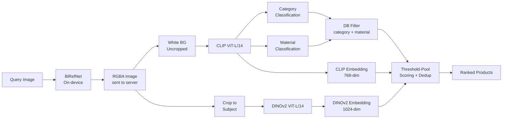

---

## 2. Pipeline Architecture

The system has two pipelines — indexing (batch, offline) and search (real-time, per query).

### 2.1 Indexing Pipeline

Runs once per catalog update. Processes every product image and stores embeddings + metadata.

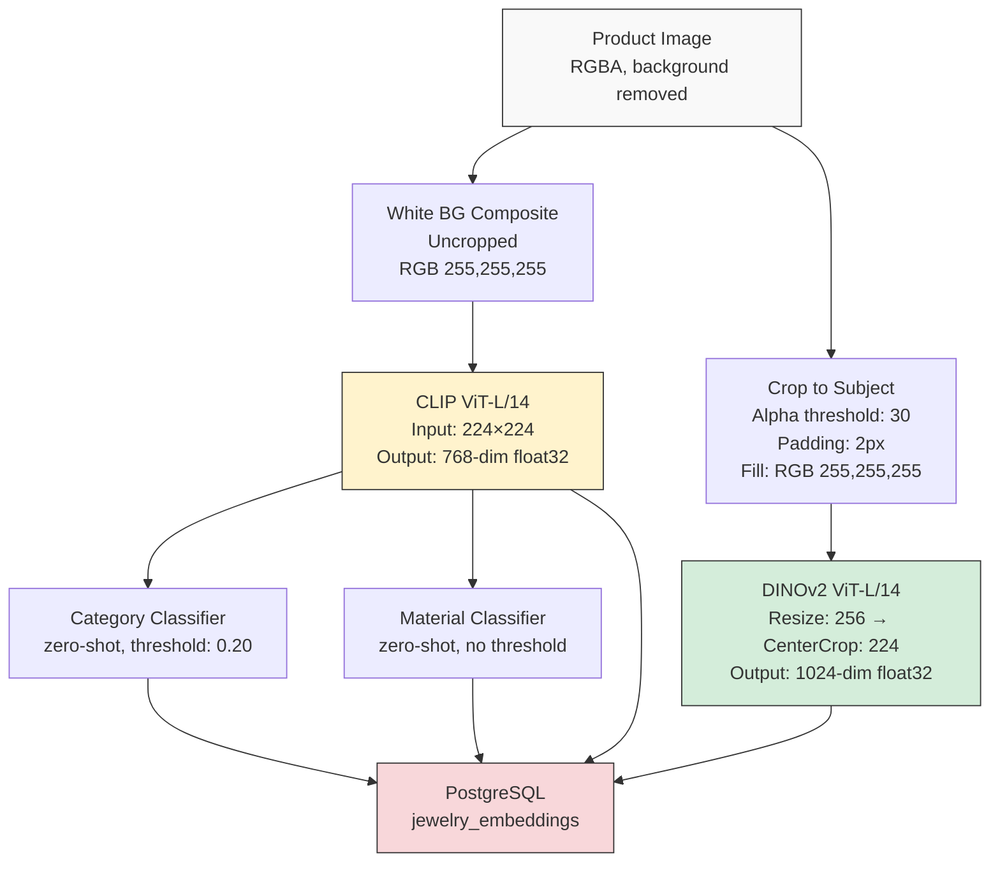

**Stored per image (PostgreSQL row):**

| Field | Type | Description |
|---|---|---|
| `id` | string (UUID) | Unique image identifier (primary key) |
| `serial_number` | string | Product identifier — one product may have multiple rows |
| `tenant_id` | string | Tenant isolation key |
| `category` | string | Predicted category (e.g., "ring") |
| `category_confidence` | float32 | Classification confidence (0–1) |
| `material` | string | Predicted material (e.g., "gold") |
| `material_confidence` | float32 | Material confidence (0–1) |
| `clip_embedding` | vector(768) | 768-dim CLIP embedding (pgvector) |
| `dino_embedding` | vector(1024) | 1024-dim DINOv2 embedding (pgvector) |
| `image_url` | text | URL to the product image |
| `created_at` | timestamp | Insert time |
| `updated_at` | timestamp | Last update time |

### 2.2 Search (Inference) Pipeline

Runs in real-time for each query image. Input is RGBA — background removal happens on-device before the image reaches the server.

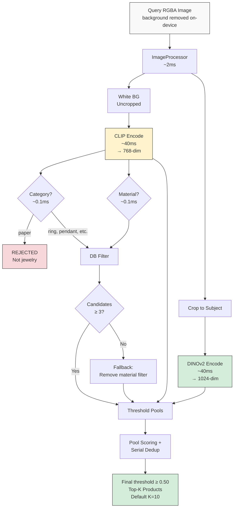

**Why uncropped for CLIP?** CLIP sees the full image including size context. A bangle (large circular band, fills the frame) and a ring (small band, lots of white space) look identical after cropping but are distinguishable in the uncropped white-background version.

**Why cropped for DINOv2?** DINOv2 divides the input into 16×16 pixel patches. On an uncropped image, 40–70% of patches encode white background instead of jewelry. Cropping forces nearly all patches onto the actual product, producing richer visual features for shape, texture, and design matching.

### 2.3 Split Processing Path — Detail

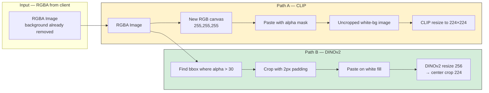

---

## 3. Step-by-Step Process

### Step 0: On-Device Background Removal (BiRefNet — client side)

**Runs on:** Client device (mobile/web), before the image is sent to the server.

**Process:** BiRefNet performs salient object segmentation. The image is resized to 1024×1024, passed through the model, and a sigmoid activation produces a per-pixel probability mask. The mask is applied as an alpha channel.

**Preprocessing normalization (ImageNet standard):**
- Mean: `[0.485, 0.456, 0.406]`
- Std: `[0.229, 0.224, 0.225]`

**Output:** RGBA image where the jewelry is opaque and the background is transparent. This is what the server receives.

### Step 1: Split Processing (ImageProcessor)

The server receives the RGBA image and produces two variants in one pass:

**Variant A — White background composite (uncropped):**
The transparent background is replaced with solid white `RGB(255, 255, 255)`. The image retains its original dimensions and the jewelry sits in its natural position within the frame.

**Variant B — Cropped to subject:**

| Parameter | Value | Purpose |
|---|---|---|
| `alpha_threshold` | 30 | Pixels with alpha ≤ 30 are treated as background |
| `padding` | 2px | Border around the bounding box to avoid clipping edges |
| `bg_color` | `RGB(255, 255, 255)` | Fill color for the padding border |

The alpha channel is analyzed to find the bounding box of non-transparent pixels (alpha > 30). The image is cropped to that bounding box with 2px padding. After DINOv2's resize to 224×224, the 2px padding becomes sub-pixel — effectively zero background.

### Step 2: CLIP Encoding (on uncropped white-bg image)

**Input:** 224×224 resized white-background image.

**Model architecture:**
| Property | Value |
|---|---|
| Backbone | ViT-L/14 (Vision Transformer, Large, patch size 14) |
| Transformer layers | 24 |
| Attention heads | 16 |
| Hidden dim | 1024 |
| Output projection | 768-dim |
| Input resolution | 224 × 224 |
| Patch size | 14 × 14 (= 256 patches per image) |
| Parameters | 428M |

**Process:** The image is divided into 256 patches of 14×14 pixels each. Each patch is linearly projected, position embeddings are added, and the sequence is processed through 24 transformer layers. The `[CLS]` token output is projected to a 768-dimensional embedding vector. The vector is L2-normalized (epsilon: `1e-8`).

**Output:** 768-dimensional float32 vector, L2-normalized.

**Used for:** Category classification (Step 3), Material classification (Step 3), CLIP component of pool scoring (Step 7).

### Step 3: Classify (Category + Material)

Both classifiers run on the same L2-normalized CLIP embedding at essentially zero cost.

#### Category Classification (zero-shot)

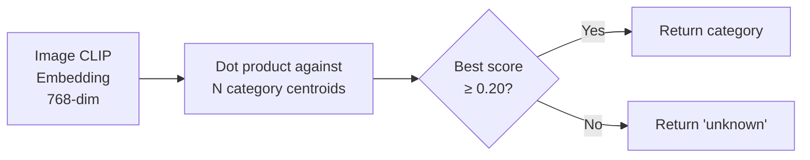

**Categories (15 total, 3–9 prompts each):**

| Category | # Prompts | Example prompts |
|---|---|---|
| ring | 9 | "a ring", "a finger ring", "a diamond ring", "a band ring" |
| necklace | 6 | "a necklace", "a choker necklace", "a gold necklace" |
| pendant | 7 | "a pendant", "a charm pendant", "a religious pendant" |
| earring | 8 | "earrings", "stud earrings", "jhumka earrings", "ear studs" |
| bracelet | 6 | "a bracelet", "a tennis bracelet", "a cuff bracelet" |
| bangle | 5 | "a bangle", "a gold bangle", "a rigid bangle bracelet" |
| chain | 7 | "a chain", "a rope chain", "a chain without pendant" |
| brooch | 5 | "a brooch", "a pin brooch", "a decorative brooch" |
| mangalsutra | 6 | "a mangalsutra with black beads chain", "jewelry with black beads and gold pendant" |
| nosering | 5 | "a nose ring", "a nose pin", "a nath" |
| anklet | 5 | "an anklet", "a gold anklet", "a payal" |
| watch | 5 | "a watch", "a wristwatch", "a luxury watch" |
| coin | 5 | "a gold coin", "a silver coin", "a bullion coin" |
| paper | 11 | "a paper document", "a receipt", "a price tag", "a barcode label" |

**Output:** `(category_name, confidence_score, all_scores_dict)`

**Configuration:**

| Parameter | Value | Description |
|---|---|---|
| `confidence_threshold` | 0.20 | Below this, category is set to "unknown" — no category filter applied |
| Paper rejection | Hard rule | If category = "paper", pipeline returns immediately with no results |

#### Material Classification (zero-shot)

No threshold is applied in the classifier itself — it always returns the best-matching material. The `material_confidence_threshold` in `SearchConfig` (default 0.20) controls whether the material filter is applied during candidate fetching.

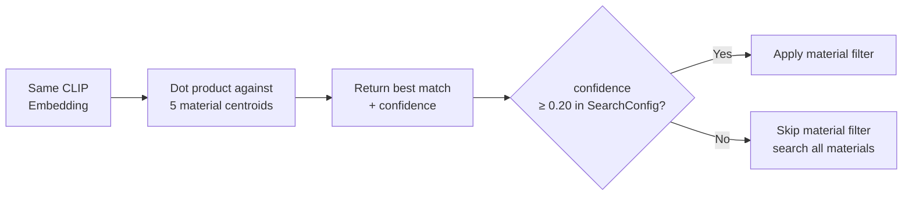

**Materials (5 total, 3 prompts each):**

| Material | Prompts |
|---|---|
| gold | "yellow gold jewelry", "golden metal jewelry", "warm toned gold ornament" |
| silver | "silver jewelry", "white silver metal jewelry", "sterling silver ornament", "grey metal jewelry" |
| rose_gold | "rose gold jewelry", "pink gold jewelry", "rose toned metal ornament" |
| platinum | "platinum jewelry", "bright white metal jewelry" |
| diamond | "diamond studded jewelry", "jewelry with diamonds", "crystal stone jewelry" |

### Step 4: DINOv2 Encoding (on cropped image)

**Input:** Cropped jewelry image, preprocessed as follows:

| Preprocessing step | Value |
|---|---|
| Resize | 256px (shorter edge) |
| Center crop | 224 × 224 |
| Normalize mean | `[0.485, 0.456, 0.406]` (ImageNet) |
| Normalize std | `[0.229, 0.224, 0.225]` (ImageNet) |

**Model architecture:**

| Property | Value |
|---|---|
| Backbone | ViT-L/14 (Vision Transformer, Large, patch size 14) |
| Training data | 142M images (LVD-142M), self-supervised |
| Training method | Self-distillation (teacher-student), no text or labels |
| Output dimension | 1024 |
| Parameters | 304M |
| Input resolution | 224 × 224 |
| Patch size | 14 × 14 (= 256 patches per image) |

**Output:** 1024-dimensional float32 vector, L2-normalized (epsilon: `1e-8`).

**What DINOv2 captures vs misses:**

| Visual property | Captured? | How |
|---|---|---|
| Shape geometry (oval vs circle) | ✅ Strong | Contour patterns across patches produce distinct clusters |
| Surface texture (engraved vs smooth) | ✅ Strong | Texture patterns within patches are well-differentiated |
| Design density (intricate vs minimal) | ✅ Strong | Patch-level complexity varies significantly |
| Spatial layout (centered vs repeating) | ✅ Moderate | Positional attention patterns encode layout |
| Material color (gold vs silver) | ⚠️ Weak | Partially captured but unreliable — CLIP handles this |

### Step 5: Filtering (DB Query)

Candidates are fetched from PostgreSQL using category and material as SQL WHERE filters. All queries are scoped by `tenant_id`.

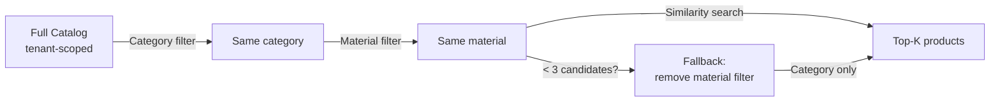

**Configuration:**

| Parameter | Value | Description |
|---|---|---|
| Category filter | Applied when category ≠ "unknown" / "other" | Removes items of different categories |
| Material filter | Applied when material confidence ≥ 0.20 | Removes items of different materials |
| Fallback threshold | < 3 candidate images remaining | If material filter is too aggressive, retry without it |

### Step 6: Threshold-Based Pool Scoring

Two independent threshold passes create candidate pools. Items that pass either threshold enter the scoring step.

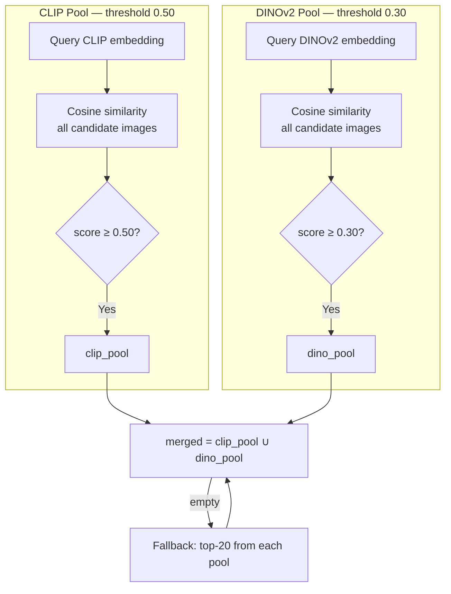

**Pool scoring rules:**

| Pool membership | Score formula | Tag |
|---|---|---|
| In both pools | `(clip_score + dino_score) / 2` | `"both"` |
| DINOv2 only | `dino_score × 0.9` (dino_only_penalty) | `"dino"` |
| CLIP only | `clip_score × 0.85` (clip_only_penalty) | `"clip"` |

**Rationale:** Items appearing in both pools receive the highest scores. Items in only one pool are penalized to reflect reduced confidence. The DINOv2 pool uses a lower threshold (0.30 vs 0.50) because DINOv2 visual similarity is the primary signal within a filtered category+material set.

### Step 7: Serial Deduplication

A product (`serial_number`) may have multiple indexed images (different orientations, angles). After pool scoring, images are grouped by `serial_number` and only the best-scoring image per product is kept.

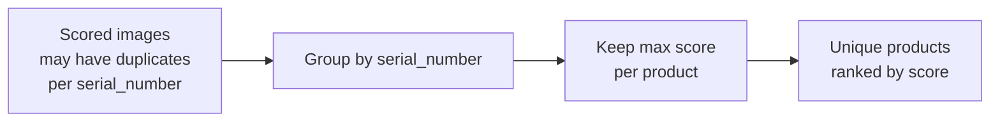

### Step 8: Final Threshold and Top-K

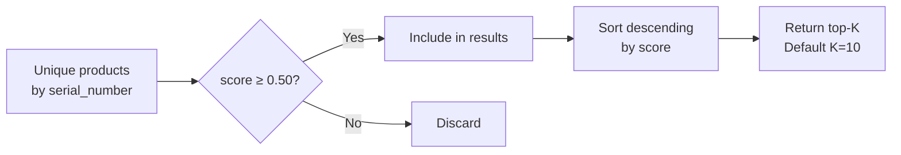

### Step 9: Ranking and Output

Products are sorted by combined score in descending order. Each result includes a full score breakdown and pool membership tag for debugging:

```
rank | serial_number         | category | material | score | clip | dino | pool
  1  | SN-00123              | bracelet | silver   | 0.912 | 0.94 | 0.91 | both
  2  | SN-00456              | bracelet | silver   | 0.810 | 0.79 | 0.90 | dino
  3  | SN-00789              | bracelet | silver   | 0.765 | 0.90 | 0.00 | clip
```

The `pool` tag enables targeted debugging — a `"dino"` result means CLIP similarity was below 0.50 but DINOv2 found a strong visual match.

**SearchResponse also includes:**
- `n_images`: total candidate images after DB filter (before dedup)
- `n_products`: unique products in the candidate set
- `pool_stats`: `clip_pool_size`, `dino_pool_size`, `merged_images`, `in_both`, `unique_products_in_pool`, `products_above_threshold`
- `rejected` / `rejected_reason`: set when image is classified as paper

---

## 4. Complete Configuration Reference

All configurable parameters in one place:

### Model Parameters

| Parameter | Value | Component |
|---|---|---|
| BiRefNet input resolution | 1024 × 1024 | Background removal (on-device) |
| BiRefNet normalize mean | `[0.485, 0.456, 0.406]` | BiRefNet preprocessing |
| BiRefNet normalize std | `[0.229, 0.224, 0.225]` | BiRefNet preprocessing |
| CLIP input resolution | 224 × 224 | CLIP encoding |
| CLIP embedding dimension | 768 | CLIP output |
| CLIP transformer layers | 24 | CLIP architecture |
| CLIP attention heads | 16 | CLIP architecture |
| CLIP patch size | 14 × 14 | CLIP architecture |
| CLIP parameters | 428M | CLIP model size |
| DINOv2 input resolution | 224 × 224 (after resize 256 + center crop) | DINOv2 encoding |
| DINOv2 embedding dimension | 1024 | DINOv2 output |
| DINOv2 normalize mean | `[0.485, 0.456, 0.406]` | DINOv2 preprocessing |
| DINOv2 normalize std | `[0.229, 0.224, 0.225]` | DINOv2 preprocessing |
| DINOv2 parameters | 304M | DINOv2 model size |

### Image Processing Parameters

| Parameter | Value | Purpose |
|---|---|---|
| White background color | `RGB(255, 255, 255)` | Composite fill for CLIP path |
| Crop alpha threshold | 30 | Pixels with alpha ≤ 30 treated as background |
| Crop padding | 2px | Border around bounding box |
| Crop fill color | `RGB(255, 255, 255)` | Padding fill for DINOv2 path |
| L2 normalization epsilon | 1e-8 | Prevents division by zero in all norm operations |

### Classification Parameters

| Parameter | Value | Purpose |
|---|---|---|
| Category confidence threshold | 0.20 | Below this → category = "unknown", no filter |
| Material confidence threshold | 0.20 (SearchConfig) | Below this → material filter skipped |
| Number of categories | 15 | Total classification targets |
| Prompts per category | 3–11 (varies) | Averaged into centroid per category |
| Number of materials | 5 | gold, silver, rose_gold, platinum, diamond |
| Prompts per material | 2–4 (varies) | Averaged into centroid per material |

### Search Parameters

| Parameter | Value | Purpose |
|---|---|---|
| `clip_pool_threshold` | 0.50 | Minimum CLIP cosine similarity to enter CLIP pool |
| `dino_pool_threshold` | 0.30 | Minimum DINOv2 cosine similarity to enter DINOv2 pool |
| `final_threshold` | 0.50 | Minimum combined score to include in final results |
| `dino_only_penalty` | 0.9 | Score multiplier for items in DINOv2 pool only |
| `clip_only_penalty` | 0.85 | Score multiplier for items in CLIP pool only |
| `pool_fallback_size` | 20 | If both pools empty, take top-N from each as fallback |
| `top_k` | 10 | Number of unique products returned |
| Fallback candidate minimum | 3 | If material filter leaves fewer images, retry without it |

### Indexing Parameters

| Parameter | Value | Purpose |
|---|---|---|
| Batch size | 4 | Images processed per batch |
| Checkpoint interval | 500 images | Save progress for crash recovery |
| Supported extensions | `.jpg .jpeg .png .webp` | Image formats accepted |

---

## 5. Latency Breakdown

Per-query latency on NVIDIA T4 GPU (server-side only — BiRefNet runs on-device):

| Stage | Time | Notes |
|---|---|---|
| ImageProcessor (white bg + crop) | ~2ms | PIL operations on RGBA input |
| CLIP encode | ~40ms | 224×224 forward pass |
| Category classify | ~0.1ms | Dot product: 768-dim × 15 centroids |
| Material classify | ~0.1ms | Dot product: 768-dim × 5 centroids |
| DINOv2 encode | ~40ms | 224×224 forward pass |
| DB fetch (category + material filter) | ~5ms | PostgreSQL query with indexed filters |
| Pool scoring (cosine similarity) | ~0.5ms | Two matrix multiplies on filtered candidate set |
| Deduplication + ranking | ~0.1ms | Python dict groupby + sort |
| **Total (server-side)** | **~88ms** | BiRefNet latency is borne by the client |

```mermaid
gantt
    title Server-Side Query Latency (~88ms total)
    dateFormat X
    axisFormat %L ms

    section Preprocessing
    White bg + crop            :0, 2

    section Encoding
    CLIP encode                :2, 42
    DINOv2 encode              :42, 82

    section Classification
    Category + Material        :82, 83

    section Search
    DB fetch + Pool + Rank     :83, 88
```

On CPU-only server deployment, CLIP and DINOv2 are the bottlenecks (~500ms–2s each). Consider DINOv2 ViT-B/14 (768-dim, ~2× faster) for CPU search pods.

---

## 6. GPU Memory Requirements

CLIP and DINOv2 loaded simultaneously on the server (BiRefNet is client-side):

| Model | VRAM (float32) | VRAM (float16) |
|---|---|---|
| CLIP ViT-L/14 | ~1.5 GB | ~0.8 GB |
| DINOv2 ViT-L/14 | ~1.5 GB | ~0.8 GB |
| PyTorch overhead | ~1.0 GB | ~1.0 GB |
| **Total (server)** | **~4.0 GB** | **~2.6 GB** |

If server-side background removal is re-enabled (BiRefNet), add ~1.5 GB (float32) or ~0.8 GB (float16).

Fits comfortably on T4 (15 GB), A10G (24 GB), or A100 (40/80 GB).

---

## 7. Storage Requirements

### PostgreSQL + pgvector

| Catalog size | CLIP column (768-dim) | DINOv2 column (1024-dim) | Estimated table size |
|---|---|---|---|
| 10,000 images | ~30 MB | ~40 MB | ~90 MB |
| 100,000 images | ~300 MB | ~400 MB | ~900 MB |
| 600,000 images | ~1.8 GB | ~2.4 GB | ~5.5 GB |

**DB indexes:**
- `idx_tenant_category` — composite index on `(tenant_id, category)`, used by all filtered queries
- `idx_tenant_material` — composite index on `(tenant_id, material)`
- `idx_tenant_serial` — composite index on `(tenant_id, serial_number)`

**HNSW vector indexes (optional, for large catalogs):**
Must be created manually — SQLAlchemy cannot create these:

```sql
CREATE INDEX idx_clip_hnsw ON jewelry_embeddings
    USING hnsw (clip_embedding vector_ip_ops)
    WITH (m=24, ef_construction=128);

CREATE INDEX idx_dino_hnsw ON jewelry_embeddings
    USING hnsw (dino_embedding vector_ip_ops)
    WITH (m=24, ef_construction=128);
```

Recommended PostgreSQL RAM: 4× index size for operational headroom.

---

## 8. Indexing Throughput

Server-side only (BiRefNet on client):

| GPU | Per image | 10,000 images | 600,000 images |
|---|---|---|---|
| T4 (Colab) | ~100ms | ~17 min | ~17 hours |
| A10G | ~65ms | ~11 min | ~11 hours |
| A100 | ~40ms | ~7 min | ~7 hours |

Checkpointing saves progress every 500 images. If the session disconnects, the pipeline skips already-processed images and continues from the checkpoint.

---

## 9. Accuracy Characteristics

### What the system handles well

- **Within-category visual similarity:** Two gold oval engraved pendants score 0.85+ on DINOv2 while a gold circular plain pendant scores 0.50. The design-centric gap is clear and actionable.
- **Cross-material filtering:** Silver queries only see silver results. Gold distractors are eliminated before scoring.
- **Non-jewelry rejection:** Paper, receipts, tags are classified as "paper" and rejected immediately.
- **Size-context classification:** Uncropped CLIP path distinguishes bangles (large, fills frame) from rings (small, lots of white space).
- **Multi-image products:** Per-product deduplication ensures the best representative image for each serial_number is returned, not multiple angles of the same product.
- **Pool fallback:** If neither pool finds matches above threshold, the top-20 from each model are merged as a safety net.

### Known limitations

- **Category classification is zero-shot.** Some visually ambiguous items may be misclassified. The uncropped white-background approach reduces this but does not eliminate it.
- **Material classification is approximate.** Two-tone jewelry (gold + silver), oxidized finishes, and unusual alloys may confuse the zero-shot material classifier. The fallback mechanism (< 3 candidates → retry without material filter) handles most failure cases.
- **Pool thresholds are fixed.** The 0.50 / 0.30 thresholds work well on average but are not optimized per category.
- **Client-side BiRefNet dependency.** Background quality depends on the client device and BiRefNet version. Poor alpha masks degrade both CLIP and DINOv2 features.

---

## 10. Future Improvements

| Improvement | Effort | Impact | Description |
|---|---|---|---|
| LLM-optimized classification prompts | Low | Medium | Use BLIP-2 to describe reference images → LLM generates CLIP-native discriminative prompts |
| Trained linear probe classifier | Low | High | Logistic regression on indexed CLIP embeddings — replaces zero-shot for category/material |
| DINOv3 upgrade | Low | Medium | Drop-in replacement: 7B params, 1.7B training images. Better dense features via Gram anchoring. |
| Product metadata blending | Medium | High | Mix client's text metadata into CLIP embeddings at index time (80:20 image:text) |
| HNSW vector index (pgvector) | Low | High (latency) | Graph-based ANN search. Required at 600k+ scale. O(log N) vs O(N) query time. |
| Per-category threshold tuning | Medium | Medium | Learn optimal clip_pool_threshold / dino_pool_threshold per category from validation set |
| Search analytics logging | Low | Medium | Log query metadata + result serial_numbers to `search_logs` table for recall analysis |
| Contrastive fine-tuning | High | Highest | Train a projection head on catalog triplets. Single embedding, no weight tuning. |
