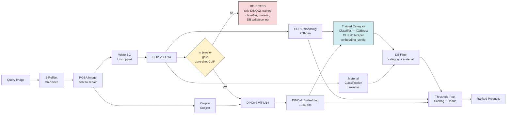
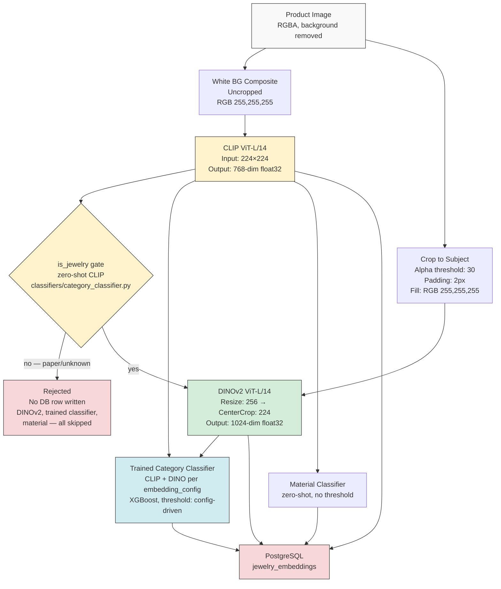
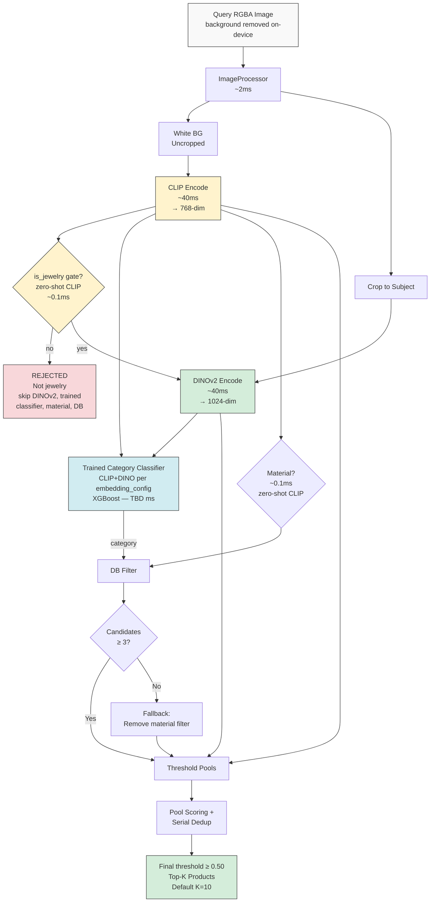
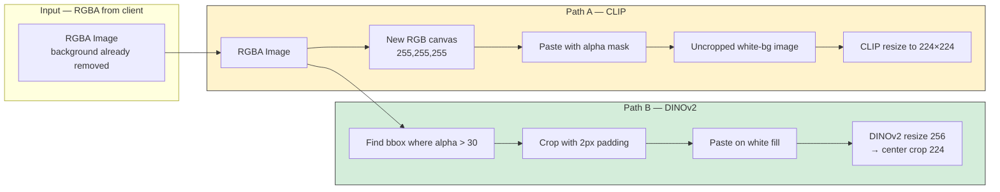
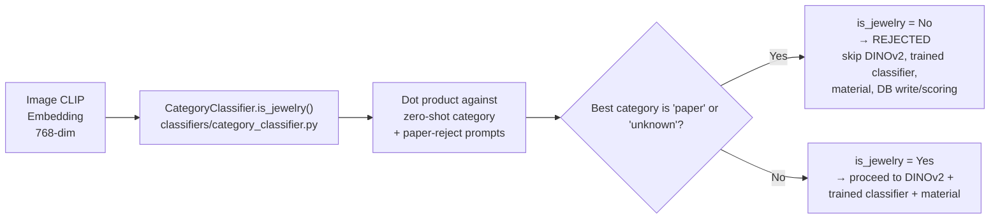
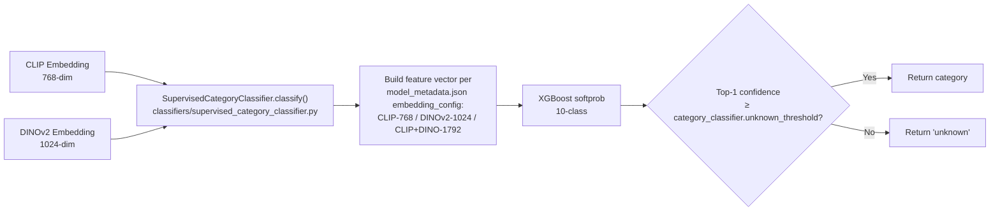
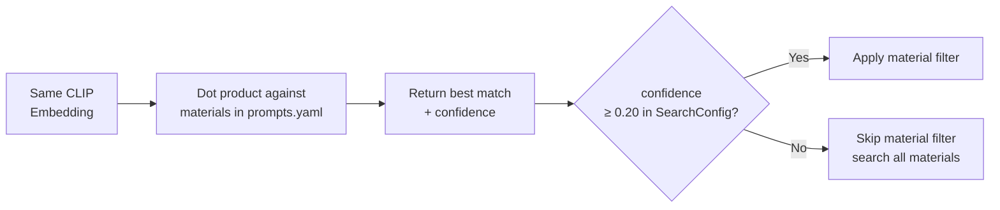

# Jewelry Image Similarity Search — Architecture Document (Updated)

> **This supersedes [architecture.md](architecture.md) for category classification.**
> `architecture.md` is kept as-is for historical reference — it documents the original
> single-step zero-shot Step 3. This document describes the new two-step classification
> flow: a narrow CLIP zero-shot **is_jewelry gate**, followed by a **trained supervised
> classifier** (CLIP+DINO embeddings → XGBoost) for the 10-class category call. Steps 0,
> 1, 2 and Material Classification are unchanged from the original and are reproduced
> here so this document stands on its own.

## 1. System Overview

The jewelry image similarity search system identifies and retrieves visually similar jewelry products from a catalog given a query photograph. It uses a multi-model architecture where each model handles a specific task it is best suited for, rather than relying on a single model for everything.

### Core Design Principles

- **Separation of concerns:** Classification, material detection, and visual similarity are handled by different models.
- **Split processing path:** A single preprocessing pass produces two image variants — each optimized for its downstream model.
- **Gate before you spend:** A cheap, narrow zero-shot CLIP check ("is this even jewelry?") runs immediately after CLIP encoding and gates every downstream step — DINOv2 encoding, the trained category classifier, and material classification all skip entirely on rejection. *(New in this revision — see §3, Step 3.)*
- **Learned classification over zero-shot, once you have labels:** Category classification (the 10-class product taxonomy) is now a trained XGBoost model over CLIP+DINO embeddings, not a zero-shot CLIP prompt bank. Zero-shot CLIP is retained only for the narrow is_jewelry gate. *(New in this revision.)*
- **Hard filters before soft ranking:** Category and material are applied as SQL filters before similarity search, not blended into embeddings.
- **On-device background removal:** BiRefNet runs on the client device. The server receives an RGBA image with background already removed.
- **Product-level deduplication:** A product (serial_number) may have multiple images. Search deduplicates to return unique products, not unique images.

### Models Used

| Model | Role | Parameters | Embedding Dim | Input Resolution | Runs On |
|---|---|---|---|---|---|
| BiRefNet | Background removal (on-device) | ~200M | N/A (outputs mask) | 1024 × 1024 | Client device |
| CLIP ViT-L/14 | is_jewelry gate, material classification, semantic similarity, CLIP embedding feature for trained classifier | 428M | 768 | 224 × 224 | GPU (index) / CPU (search) |
| DINOv2 ViT-L/14 | Visual similarity search (shape, texture, design), DINO embedding feature for trained classifier | 304M | 1024 | 224 × 224 | GPU (index) / CPU (search) |
| **Trained Category Classifier (XGBoost)** | **10-class category classification, using CLIP and/or DINO embeddings per `model_metadata.json`** | Tree ensemble (small, CPU-fast) | N/A — consumes CLIP (768) / DINO (1024) / CLIP+DINO (1792) features | N/A (no image input — embeddings only) | CPU (index and search) |

### Why Four Models?

Each model has a fundamentally different training objective that determines what it "sees":

- **CLIP** (trained on 400M image-text pairs): Sees "this is a gold pendant." Misses whether it's oval or circular, engraved or plain. Used narrowly here as the is_jewelry gate (junk vs. jewelry photo) and for material.
- **DINOv2** (trained on 142M images, self-supervised, no text): Sees oval shape, dense engraving, relief texture, spatial layout. Misses whether it's gold or silver (both look like "shiny metal").
- **BiRefNet** (trained on segmentation datasets): Sees foreground jewelry vs background. Outputs a pixel-level alpha mask. Runs on-device before the image is sent to the server.
- **Trained Category Classifier** (XGBoost, trained on labeled catalog images): Sees the fine-grained boundary between the 10 product categories by learning directly from CLIP's semantic signal and/or DINOv2's shape/texture signal — whichever combination (`embedding_config`) scored best during training. Where zero-shot CLIP alone struggles with categories that look similar in a text-prompt sense but differ in shape (e.g., bangle vs. bracelet, chain vs. necklace), a supervised model trained on real examples of each class can pick up the distinguishing signal directly, including from DINOv2's shape sensitivity.

No single model captures all these concerns (junk-rejection, category, material, visual design). Combining them gives each query multiple layers of precision, gated so the more expensive models only run on inputs worth paying for.

### High-Level Architecture

The critical structural change from the original diagram: **DINOv2 encoding is no longer parallel to CLIP-based classification.** It — along with the trained category classifier and material classification — is now strictly downstream of the is_jewelry gate. A rejected image never reaches DINOv2, never gets a trained-classifier call, never gets a material call, and never gets a DB row or a candidate-scoring slot.

---

## 2. Pipeline Architecture

The system has two pipelines — indexing (batch, offline) and search (real-time, per query). Both now follow the same sequential, gate-first structure.

### 2.1 Indexing Pipeline

Runs once per catalog update. Processes every product image and stores embeddings + metadata — but only for images that pass the is_jewelry gate.

**Stored per image (PostgreSQL row) — unchanged field names, new source for category/category_confidence:**

| Field | Type | Description |
|---|---|---|
| `id` | string (UUID) | Unique image identifier (primary key) |
| `serial_number` | string | Product identifier — one product may have multiple rows |
| `tenant_id` | string | Tenant isolation key |
| `category` | string | Predicted category — now from the trained 10-class classifier (e.g., "ring"), not zero-shot CLIP |
| `category_confidence` | float32 | Trained-classifier confidence (0–1) |
| `material` | string | Predicted material (e.g., "gold") — unchanged, zero-shot |
| `material_confidence` | float32 | Material confidence (0–1) — unchanged |
| `clip_embedding` | vector(768) | 768-dim CLIP embedding (pgvector) |
| `dino_embedding` | vector(1024) | 1024-dim DINOv2 embedding (pgvector) |
| `image_url` | text | URL to the product image |
| `created_at` | timestamp | Insert time |
| `updated_at` | timestamp | Last update time |

Rejected images (gate says "no") produce no row at all — `indexing/pipeline.py`'s `IndexingPipeline.process()` returns an `IndexRecord` with `rejected=True` and `rejected_reason` set; callers must skip the DB write for these records, exactly as they would skip a record with `error` set.

### 2.2 Search (Inference) Pipeline

Runs in real-time for each query image. Input is RGBA — background removal happens on-device before the image reaches the server.

**Performance profile change:** because the is_jewelry gate now runs before DINOv2 encoding (previously DINOv2 ran unconditionally, in parallel with CLIP-based classification), a rejected query image now **skips the ~40ms DINOv2 forward pass entirely**, along with the trained classifier call, the material classify call, and the DB round-trip. For a rejected image, server-side latency is roughly `preprocess (~2ms) + CLIP encode (~40ms) + gate (~0.1ms)` — on the order of ~42ms total, versus the full ~88ms path for an accepted image (see §5 for the updated breakdown and what's still TBD).

**Why uncropped for CLIP?** CLIP sees the full image including size context. A bangle (large circular band, fills the frame) and a ring (small band, lots of white space) look identical after cropping but are distinguishable in the uncropped white-background version.

**Why cropped for DINOv2?** DINOv2 divides the input into 16×16 pixel patches. On an uncropped image, 40–70% of patches encode white background instead of jewelry. Cropping forces nearly all patches onto the actual product, producing richer visual features for shape, texture, and design matching.

### 2.3 Split Processing Path — Detail

Unchanged from the original — this preprocessing split happens upfront for every image regardless of gate outcome, since it's cheap (~2ms) and CLIP needs its variant regardless of the gate result.

Only the ENCODING and classification calls that follow are conditional/sequential now (see §2.1, §2.2) — the preprocessing split itself is unchanged and unconditional.

---

## 3. Step-by-Step Process

### Step 0: On-Device Background Removal (BiRefNet — client side)

**Runs on:** Client device (mobile/web), before the image is sent to the server.

**Process:** BiRefNet performs salient object segmentation. The image is resized to 1024×1024, passed through the model, and a sigmoid activation produces a per-pixel probability mask. The mask is applied as an alpha channel.

**Preprocessing normalization (ImageNet standard):**
- Mean: `[0.485, 0.456, 0.406]`
- Std: `[0.229, 0.224, 0.225]`

**Output:** RGBA image where the jewelry is opaque and the background is transparent. This is what the server receives.

### Step 1: Split Processing (ImageProcessor)

The server receives the RGBA image and produces two variants in one pass:

**Variant A — White background composite (uncropped):**
The transparent background is replaced with solid white `RGB(255, 255, 255)`. The image retains its original dimensions and the jewelry sits in its natural position within the frame.

**Variant B — Cropped to subject:**

| Parameter | Value | Purpose |
|---|---|---|
| `alpha_threshold` | 30 | Pixels with alpha ≤ 30 are treated as background |
| `padding` | 2px | Border around the bounding box to avoid clipping edges |
| `bg_color` | `RGB(255, 255, 255)` | Fill color for the padding border |

The alpha channel is analyzed to find the bounding box of non-transparent pixels (alpha > 30). The image is cropped to that bounding box with 2px padding. After DINOv2's resize to 224×224, the 2px padding becomes sub-pixel — effectively zero background.

### Step 2: CLIP Encoding (on uncropped white-bg image)

**Input:** 224×224 resized white-background image.

**Model architecture:**
| Property | Value |
|---|---|
| Backbone | ViT-L/14 (Vision Transformer, Large, patch size 14) |
| Transformer layers | 24 |
| Attention heads | 16 |
| Hidden dim | 1024 |
| Output projection | 768-dim |
| Input resolution | 224 × 224 |
| Patch size | 14 × 14 (= 256 patches per image) |
| Parameters | 428M |

**Process:** The image is divided into 256 patches of 14×14 pixels each. Each patch is linearly projected, position embeddings are added, and the sequence is processed through 24 transformer layers. The `[CLS]` token output is projected to a 768-dimensional embedding vector. The vector is L2-normalized (epsilon: `1e-8`).

**Output:** 768-dimensional float32 vector, L2-normalized.

**Used for:** is_jewelry gate (Step 3a), trained category classifier feature (Step 3b), material classification (Step 3c), CLIP component of pool scoring (Step 7).

### Step 3: Classify — is_jewelry Gate → Trained Category Classifier → Material

This is the step that changed. It is now three sub-steps, sequential, with the first gating the rest.

#### Step 3a: is_jewelry Gate (zero-shot CLIP, narrow binary check)

Runs immediately after CLIP encoding, before anything else — including DINOv2 encoding.

This reuses the exact same zero-shot CLIP scoring machinery as before (`classifiers/category_classifier.py`, `CategoryClassifier.classify()`) — nothing about the zero-shot logic itself was removed or rewritten. It is wrapped by a new `is_jewelry()` method that maps the zero-shot classify() result to a binary decision: `category in {"paper", "unknown"}` → reject, anything else → pass. `"paper"` is the explicit non-jewelry/junk reject class (receipts, tags, backgrounds); `"unknown"` is what `classify()` already returns when the best zero-shot score is below `category_confidence_threshold` (0.20, `config.yaml` → `search.category_confidence_threshold`).

This gate is shared, not duplicated: the same `is_jewelry()` method is used by the indexing pipeline, the search pipeline, and the QA app (`qa_app/pipeline.py`), so gate behavior cannot drift between them.

**On rejection**, this mirrors the reject path that already existed in the search pipeline for `"paper"` — no DB read, no results, `rejected=True` / `rejected_reason` set on the response — now triggered by the gate instead of the old 15-way zero-shot category call. On the indexing side, a rejected image produces an `IndexRecord` with `rejected=True` and no CLIP-only-partial DB row should be written for it.

#### Step 3b: Trained Category Classifier (10-class, CLIP+DINO → XGBoost)

Only runs on images that passed the is_jewelry gate — and only after DINOv2 encoding has completed, because the model may depend on the DINO embedding.

**Categories (10 total):** `earring`, `necklace`, `bracelet`, `pendant`, `bangle`, `ring`, `mangalsutra`, `chain`, `anklet`, `other`.

**Module:** `classifiers/supervised_category_classifier.py` (`SupervisedCategoryClassifier`) — this is the same shared wrapper class used by the QA app (`qa_app/model_loader.py`, `qa_app/pipeline.py`). It is imported from this one location by both the indexing/search pipeline and the QA app; there is no duplicate implementation.

**Artifacts (identical paths for the pipeline and the QA app — `config.yaml` → `category_classifier.model_dir`, default `model/`):**
- `model/category_classifier.xgb` — the trained XGBoost booster
- `model/label_encoder.joblib` — maps class indices → category names
- `model/model_metadata.json` — records `model_type`, `embedding_config`, `target_classes`, and training metrics

**`embedding_config` is read from `model_metadata.json` at load time, not assumed.** The training notebook (`jewelry_category_classifier (1).ipynb`) trains and evaluates all three combinations — `CLIP-768`, `DINOv2-1024`, `CLIP+DINO-1792` — and exports whichever won on validation/test macro-F1. `SupervisedCategoryClassifier.__init__` and `_build_features()` branch on this string at runtime to decide which embedding(s) to concatenate.

> **Note on this environment:** `model/` in this branch currently contains only `.gitkeep` — no trained artifacts are present, so the actual winning `embedding_config` cannot be confirmed from this repo checkout. **This is called out explicitly as TBD** rather than assumed. Both pipelines are written to handle any of the three configs correctly (they always compute both CLIP and DINO embeddings for images that pass the gate, and pass both into `classify()` regardless of which the model actually needs), so no code change is required once real artifacts land — only the latency/accuracy numbers in this document need to be filled in.

**Sequencing:** if `embedding_config` includes DINO (`DINOv2-1024` or `CLIP+DINO-1792`), the classifier depends on both embeddings, so it must run — and now does run — strictly after both CLIP encode and DINOv2 encode complete, not in parallel with DINOv2 encode as classification used to run.

**Output:** `(predicted_category, confidence, all_class_scores)` — same 3-tuple shape as the old zero-shot `classify()`, so it's a drop-in in terms of interface.

**Configuration:**

| Parameter | Value | Description |
|---|---|---|
| `category_classifier.unknown_threshold` | Config value in `config.yaml` (placeholder: 0.50 — **needs recalibration** against this model's confidence distribution; the old 0.20 zero-shot threshold does not carry over) | Below this, category is set to "unknown" — no category filter applied. Applied post-hoc inside `SupervisedCategoryClassifier`, same pattern as before. |
| `category_classifier.model_dir` | `model` | Directory containing the three trained-classifier artifacts |

#### Step 3c: Material Classification (zero-shot, unchanged)

No threshold is applied in the classifier itself — it always returns the best-matching material. The `material_confidence_threshold` in `SearchConfig` (default 0.20) controls whether the material filter is applied during candidate fetching. **The only change here is when it runs:** now strictly after the is_jewelry gate passes, not unconditionally alongside category classification.

Material list and prompts are unchanged — see `config/prompts.yaml` → `materials:`.

### Step 4: DINOv2 Encoding (on cropped image) — now conditional on the is_jewelry gate

**This step only runs for images that passed the is_jewelry gate (Step 3a).** Previously it ran unconditionally, in parallel with CLIP-based classification, for every image. It is otherwise architecturally unchanged.

**Input:** Cropped jewelry image, preprocessed as follows:

| Preprocessing step | Value |
|---|---|
| Resize | 256px (shorter edge) |
| Center crop | 224 × 224 |
| Normalize mean | `[0.485, 0.456, 0.406]` (ImageNet) |
| Normalize std | `[0.229, 0.224, 0.225]` (ImageNet) |

**Model architecture:**

| Property | Value |
|---|---|
| Backbone | ViT-L/14 (Vision Transformer, Large, patch size 14) |
| Training data | 142M images (LVD-142M), self-supervised |
| Training method | Self-distillation (teacher-student), no text or labels |
| Output dimension | 1024 |
| Parameters | 304M |
| Input resolution | 224 × 224 |
| Patch size | 14 × 14 (= 256 patches per image) |

**Output:** 1024-dimensional float32 vector, L2-normalized (epsilon: `1e-8`).

**Used for:** trained category classifier feature (Step 3b, when `embedding_config` includes DINO), DINOv2 component of pool scoring (Step 7).

**What DINOv2 captures vs misses:**

| Visual property | Captured? | How |
|---|---|---|
| Shape geometry (oval vs circle) | ✅ Strong | Contour patterns across patches produce distinct clusters |
| Surface texture (engraved vs smooth) | ✅ Strong | Texture patterns within patches are well-differentiated |
| Design density (intricate vs minimal) | ✅ Strong | Patch-level complexity varies significantly |
| Spatial layout (centered vs repeating) | ✅ Moderate | Positional attention patterns encode layout |
| Material color (gold vs silver) | ⚠️ Weak | Partially captured but unreliable — CLIP handles this |

### Step 5: Filtering (DB Query)

Candidates are fetched from PostgreSQL using category and material as SQL WHERE filters. All queries are scoped by `tenant_id`. Unchanged mechanically — the only difference is that `category` now comes from the trained classifier's 10-class taxonomy instead of the old zero-shot 15-way taxonomy (see §4 Migration Notes for what this means for existing rows).

**Configuration:**

| Parameter | Value | Description |
|---|---|---|
| Category filter | Applied when category ≠ "unknown" / "other" | Removes items of different categories |
| Material filter | Applied when material confidence ≥ 0.20 | Removes items of different materials |
| Fallback threshold | < 3 candidate images remaining | If material filter is too aggressive, retry without it |

### Steps 6–9: Pool Scoring, Dedup, Threshold, Ranking — unchanged

These steps operate purely on CLIP and DINOv2 embeddings and are unaffected by the classification restructuring. See [architecture.md §3, Steps 6–9](architecture.md#step-6-threshold-based-pool-scoring) for the full, unchanged detail (threshold pools, scoring formula, serial deduplication, final threshold/top-K, ranking output format).

---

## 4. Migration Notes

### Taxonomy change: 15-category zero-shot → 10-class trained

| | Old (zero-shot CLIP, `architecture.md` Step 3) | New (trained XGBoost, this document) |
|---|---|---|
| Categories | 15 total: `ring, necklace, pendant, earring, bracelet, bangle, chain, brooch, mangalsutra, nosering, anklet, watch, coin, paper` (+ `unknown` fallback) | 10 total: `earring, necklace, bracelet, pendant, bangle, ring, mangalsutra, chain, anklet, other` (+ `unknown` fallback, applied post-hoc by threshold) |
| Non-jewelry rejection | Implicit — `paper` was one of the 15 classes; a hard rule rejected the whole search on `category == "paper"` | Explicit, separate step — the is_jewelry gate (still zero-shot CLIP, still using `paper`/`unknown` as its reject signal) runs *before* category classification, not as one branch of it |
| Decision mechanism | Dot product against prompt-bank centroids, threshold 0.20 | Trained XGBoost softprob over CLIP and/or DINO embeddings, threshold config-driven (`category_classifier.unknown_threshold`) |

**Legacy category mapping — categories no longer produced by the new classifier:**

The trained model was trained on exactly the 10 `TARGET_CLASSES` above; it cannot and will not output `brooch`, `nosering`, `watch`, or `coin` — those are not classes it was trained on. Per the training taxonomy, all four now fall under **`other`**:

| Old zero-shot category | New trained-classifier category |
|---|---|
| `brooch` | `other` |
| `nosering` | `other` |
| `watch` | `other` |
| `coin` | `other` |
| `paper` | *(not a category anymore — handled by the is_jewelry gate, image is rejected outright)* |

**⚠️ Flag for existing indexed data:** any `jewelry_embeddings` rows already indexed under the old zero-shot classifier may carry `category` values of `"brooch"`, `"nosering"`, `"watch"`, or `"coin"` (or other pre-10-class values) that the new trained classifier will never produce going forward. This is not a schema change — `category` and `category_confidence` remain the same column names/types — but it is a **data consistency issue**: a search query that the new pipeline classifies as `"other"` will not match old rows still labeled `"brooch"` under a `category = :category` SQL filter, silently under-returning results for that legacy long-tail. Two options, not implemented as part of this change:
1. **Backfill/reclassify existing rows** by re-running them through the new gate + trained classifier (requires re-computing DINO embeddings if `embedding_config` needs them — `dino_embedding` is already stored per-row in `jewelry_embeddings`, so a backfill script could read stored `clip_embedding`/`dino_embedding` columns directly without re-encoding images, as long as the columns are populated).
2. **Normalize old category values in place** by mapping `brooch`/`nosering`/`watch`/`coin` → `other` via a one-time `UPDATE` — cheaper, but loses the finer-grained label if the taxonomy is ever expanded back.

Note that `indexing/reclassify_embeddings.py` already exists as a batch reclassification utility, but it currently (a) still calls the old zero-shot `CategoryClassifier`, and (b) only reads `clip_*` columns from its input CSV, with no DINO embedding support — it would need to be updated to use `SupervisedCategoryClassifier` and read `dino_*` columns before it could serve as the backfill tool referenced above. This was left out of scope for this change since it isn't part of the indexing or search pipeline proper, but is flagged here as a natural next step.

`docs/SEARCH_ARCHITECTURE.md` also still documents the old single-step zero-shot flow and was not updated as part of this change — flagged here as a follow-up, since this document (`architecture_updated.md`) is now the source of truth for the classification flow.

---

## 5. Latency Breakdown (Updated)

Per-query latency on NVIDIA T4 GPU (server-side only — BiRefNet runs on-device). Rows marked **TBD** could not be benchmarked in this environment: `model/` contains no trained classifier artifacts (only `.gitkeep`) and `xgboost` is not installed here, so there is nothing to load and time. These should be filled in against the real deployed model before relying on this table for capacity planning.

| Stage | Time | Notes |
|---|---|---|
| ImageProcessor (white bg + crop) | ~2ms | PIL operations on RGBA input — unchanged |
| CLIP encode | ~40ms | 224×224 forward pass — unchanged |
| **is_jewelry gate** | **~0.1ms** | Same zero-shot dot product as the old category classify: 768-dim × ~11 prompt-bank entries (10 categories + paper) — cost is unchanged from the old zero-shot call, just narrower in what it decides |
| DINOv2 encode | ~40ms | 224×224 forward pass — **now skipped entirely for rejected images** (previously ran unconditionally) |
| **Trained category classify (XGBoost)** | **TBD — needs benchmarking** | No trained artifacts present in this environment to measure against. Expect low-single-digit ms at most for a small tree ensemble on CPU (a fitted XGBoost booster with ~10 classes typically predicts in well under 1ms per sample on CPU once loaded), but this is an estimate, not a measurement — do not use it for capacity planning until benchmarked against the real `model/category_classifier.xgb` |
| Material classify | ~0.1ms | Dot product: 768-dim × 6 material centroids — unchanged, now runs after the gate instead of alongside the old category classify |
| DB fetch (category + material filter) | ~5ms | PostgreSQL query with indexed filters — unchanged, skipped for rejected images |
| Pool scoring (cosine similarity) | ~0.5ms | Two matrix multiplies on filtered candidate set — unchanged, skipped for rejected images |
| Deduplication + ranking | ~0.1ms | Python dict groupby + sort — unchanged, skipped for rejected images |
| **Total (server-side, accepted image)** | **~88ms + TBD** | Same as before plus the (currently unmeasured) trained-classifier call |
| **Total (server-side, rejected image)** | **~42ms** | `preprocess (~2ms) + CLIP encode (~40ms) + gate (~0.1ms)` — DINOv2, trained classify, material classify, DB fetch, and pool scoring are all skipped |

```mermaid
gantt
    title Server-Side Query Latency — Accepted Image (~88ms + TBD trained-classify)
    dateFormat X
    axisFormat %L ms

    section Preprocessing
    White bg + crop            :0, 2

    section Encoding
    CLIP encode                :2, 42

    section Gate
    is_jewelry gate             :42, 43

    section Encoding (gated)
    DINOv2 encode               :43, 83

    section Classification (gated)
    Trained classify (TBD)     :83, 84
    Material classify          :84, 85

    section Search
    DB fetch + Pool + Rank     :85, 90
```

```mermaid
gantt
    title Server-Side Query Latency — Rejected Image (~42ms, new fast path)
    dateFormat X
    axisFormat %L ms

    section Preprocessing
    White bg + crop            :0, 2

    section Encoding
    CLIP encode                :2, 42

    section Gate
    is_jewelry gate (reject)    :42, 43
```

On CPU-only server deployment, CLIP and DINOv2 are the bottlenecks (~500ms–2s each) — the trained classifier's tree-ensemble inference is expected to remain cheap by comparison regardless of CPU vs. GPU, but again, TBD pending real benchmarking. Consider DINOv2 ViT-B/14 (768-dim, ~2× faster) for CPU search pods.

---

## 6. Configuration Reference (Classification-Relevant Delta)

Only the classification-related rows changed from [architecture.md §4](architecture.md#4-complete-configuration-reference); everything else (model params, image processing params, search pool params, indexing throughput params) is unchanged and not repeated here.

| Parameter | Value | Purpose |
|---|---|---|
| `search.category_confidence_threshold` | 0.20 | Threshold for the **is_jewelry gate** (zero-shot CLIP) — below this, best zero-shot match is "unknown" → gate rejects. No longer drives category classification itself. |
| `category_classifier.model_dir` | `model` (config.yaml, new section) | Directory holding `category_classifier.xgb`, `label_encoder.joblib`, `model_metadata.json` — same path convention as `qa_app.category_classifier_model_dir`, intentionally kept in sync so pipeline and QA app never diverge |
| `category_classifier.unknown_threshold` | 0.50 (placeholder — **needs recalibration**, config.yaml, new value) | Post-hoc confidence threshold for the **trained classifier**: below this, category = "unknown". Do not assume the old zero-shot 0.20 value applies — the trained model's confidence distribution has not yet been characterized against this threshold. |
| Number of trained categories | 10 | `earring, necklace, bracelet, pendant, bangle, ring, mangalsutra, chain, anklet, other` — down from 15 zero-shot categories (see §4 Migration Notes) |
| `embedding_config` | Read from `model_metadata.json` at load time (`CLIP-768` / `DINOv2-1024` / `CLIP+DINO-1792`) | Not assumed or hardcoded — both pipelines always compute both CLIP and DINO embeddings for gate-passed images so they can serve any winning config without a code change |

---

## 7. Accuracy Characteristics (Delta)

- **Category classification is no longer zero-shot** — it's a supervised model trained on labeled catalog images, which should meaningfully improve on the known zero-shot weak spots called out in the original document (visually-ambiguous items, especially near-duplicate categories like bangle/bracelet or chain/necklace where shape — not just semantics — is the distinguishing signal DINOv2 can supply that CLIP alone could not).
- **The is_jewelry gate is still zero-shot CLIP**, and inherits the same known limitation as the old Step 3: it's a prompt-bank dot product, not a trained classifier, so its accuracy characteristics (and its false-accept / false-reject behavior) are unchanged from the original system's "paper rejection" behavior — it's just been narrowed in scope, not improved in kind. If gate accuracy turns out to be a bottleneck, that would be a natural target for its own trained binary classifier in a future iteration.
- **Confidence calibration is an open item.** The `category_classifier.unknown_threshold` value in this document (0.50) is a placeholder, not a calibrated value — see §5 and §6.

---

## 8. Unchanged Sections

The following sections of [architecture.md](architecture.md) are unaffected by this change and are not reproduced here — refer to the original document:
- §5 Latency Breakdown baseline methodology (superseded numerically by §5 above, but the measurement approach is the same)
- §6 GPU Memory Requirements (the XGBoost model is a small tree ensemble — expect low double-digit MB at most, negligible relative to CLIP/DINOv2 VRAM; TBD to confirm exact footprint once real artifacts are available)
- §7 Storage Requirements
- §8 Indexing Throughput (mechanically unchanged, though rejected images now exit the pipeline earlier — net throughput on catalogs with a meaningful junk/reject rate should improve, not measured here)
- §10 Future Improvements — "Trained linear probe classifier — replaces zero-shot for category/material" is effectively **done** for category (this document); material classification remains zero-shot and out of scope for this change.
