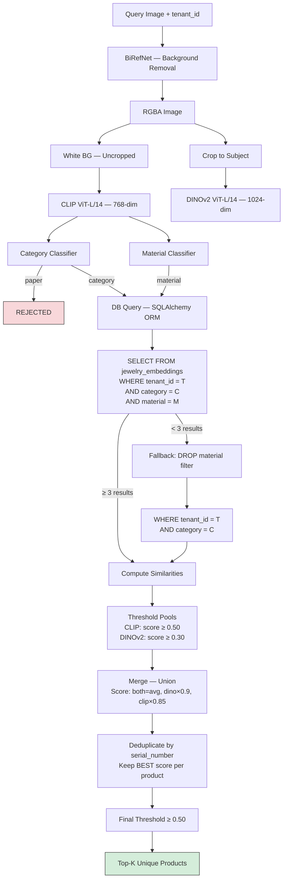
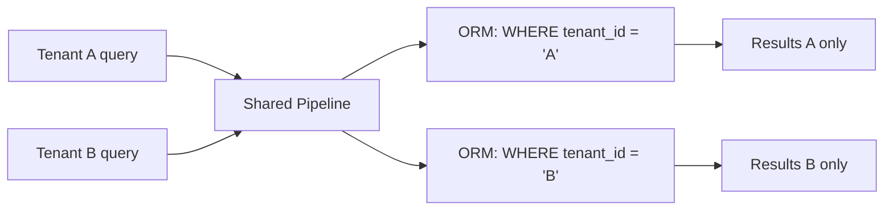

# Search Pipeline — Architecture & Scoring

## 1. Pipeline Overview

The search pipeline accepts a query image and tenant_id, returns ranked **unique products** from that tenant's catalog. It uses **threshold-based pools** where each model independently selects all images above a quality threshold, then deduplicates by serial_number to return unique products.

### Why threshold pools instead of fixed top-N?

A product can have up to 5 images (different orientations). With a fixed pool of 10, you get only 2 products. Threshold pools let a variable number of images in based on quality, and deduplication ensures unique products in the final results.

```
Fixed pool (broken):     top 10 images = 2 products × 5 orientations = useless
Threshold pool (correct): all images above threshold → dedup → many unique products
```

## 2. Pipeline Flow



## 3. Scoring — Step by Step

### Step 1: Compute similarities

For each candidate image `i`:

```
clip_score(i)  = cos(query_clip,  candidate_clip[i])
dino_score(i)  = cos(query_dino,  candidate_dino[i])

                    A · B
where cos(A, B) = ─────────────
                  ‖A‖ × ‖B‖
```

### Step 2: Threshold-based pool selection

```
CLIP_pool  = { i : clip_score(i)  ≥ clip_pool_threshold  }
DINOv2_pool = { i : dino_score(i) ≥ dino_pool_threshold }

If both pools empty → fallback: take top 20 from each
```

Pool sizes are **variable** — determined by data quality, not a fixed number.

### Step 3: Merge and score

```
merged  = CLIP_pool ∪ DINOv2_pool
overlap = CLIP_pool ∩ DINOv2_pool

For each image i in merged:
  If i ∈ overlap:      score = (clip_score + dino_score) / 2    [both models agree]
  If i ∈ DINOv2 only:  score = dino_score × 0.9                 [design match]
  If i ∈ CLIP only:    score = clip_score × 0.85                 [material match]
```

### Step 4: Deduplicate by serial_number

A product "RN00005" may have 5 images in the pool:

```
RN00005_front.jpg    score = 0.82
RN00005_side.jpg     score = 0.78
RN00005_top.jpg      score = 0.75
RN00005_angle.jpg    score = 0.71
RN00005_back.jpg     score = 0.68

After dedup → RN00005: score = 0.82 (best orientation kept)
```

### Step 5: Final threshold + top-K

```
filtered = { product : score ≥ final_threshold }
results  = top K of filtered, sorted by score descending
```

## 4. Scoring Examples

### Example A: In both pools — strongest match

```
Query: gold ring with solitaire diamond

Product RN00123 (best image):
  clip_score = 0.89    (in CLIP pool ✓)
  dino_score = 0.85    (in DINOv2 pool ✓)
  pool = "both"
  score = (0.89 + 0.85) / 2 = 0.870   ✅ rank #1
```

### Example B: DINOv2 only — design match, material uncertain

```
Product RN00456 (best image):
  clip_score = 0.45    (below CLIP threshold ✗)
  dino_score = 0.82    (in DINOv2 pool ✓)
  pool = "dino"
  score = 0.82 × 0.9 = 0.738   ✅ above final threshold
```

### Example C: CLIP only — material match, different design

```
Product RN00789 (best image):
  clip_score = 0.88    (in CLIP pool ✓)
  dino_score = 0.22    (below DINOv2 threshold ✗)
  pool = "clip"
  score = 0.88 × 0.85 = 0.748   ✅ but ranks below both-pool matches
```

### Example D: Below final threshold — excluded

```
Product RN00999 (best image):
  clip_score = 0.52    (in CLIP pool ✓)
  dino_score = 0.20    (below DINOv2 threshold ✗)
  pool = "clip"
  score = 0.52 × 0.85 = 0.442   ❌ below 0.50 final threshold
```

## 5. Database Layer — SQLAlchemy ORM

### Table model

```python
class JewelryEmbedding(Base):
    __tablename__ = "jewelry_embeddings"

    id                  = Column(String, primary_key=True)
    serial_number       = Column(String, nullable=False, index=True)
    tenant_id           = Column(String, nullable=False, index=True)
    category            = Column(String)
    category_confidence = Column(Float)
    material            = Column(String)
    material_confidence = Column(Float)
    clip_embedding      = Column(Vector(768))
    dino_embedding      = Column(Vector(1024))
    image_url           = Column(Text)
    created_at          = Column(DateTime)
    updated_at          = Column(DateTime)
```

### Search query (ORM)

```python
stmt = (
    select(JewelryEmbedding)
    .where(and_(
        JewelryEmbedding.tenant_id == tenant_id,
        JewelryEmbedding.category == category,
        JewelryEmbedding.material == material,
    ))
)
rows = session.execute(stmt).scalars().all()
```

### Indexes

```sql
CREATE INDEX idx_tenant_category ON jewelry_embeddings(tenant_id, category);
CREATE INDEX idx_tenant_material ON jewelry_embeddings(tenant_id, material);
CREATE INDEX idx_tenant_serial   ON jewelry_embeddings(tenant_id, serial_number);
CREATE INDEX idx_clip_hnsw ON jewelry_embeddings
    USING hnsw (clip_embedding vector_ip_ops) WITH (m=24, ef_construction=128);
CREATE INDEX idx_dino_hnsw ON jewelry_embeddings
    USING hnsw (dino_embedding vector_ip_ops) WITH (m=24, ef_construction=128);
```

## 6. Configuration

```yaml
search:
  top_k: 10
  clip_pool_threshold: 0.50
  dino_pool_threshold: 0.30
  final_threshold: 0.50
  pool_fallback_size: 20
  dino_only_penalty: 0.9
  clip_only_penalty: 0.85
```

| Parameter | Default | Description |
|---|---|---|
| `top_k` | 10 | Max unique products returned |
| `clip_pool_threshold` | 0.50 | Min CLIP score to enter pool |
| `dino_pool_threshold` | 0.30 | Min DINOv2 score to enter pool |
| `final_threshold` | 0.50 | Min merged score for results |
| `pool_fallback_size` | 20 | Top-N per model if both pools empty |
| `dino_only_penalty` | 0.9 | Penalty for DINOv2-only matches |
| `clip_only_penalty` | 0.85 | Penalty for CLIP-only matches |

## 7. Latency

| Stage | Time (T4 GPU) |
|---|---|
| BiRefNet | ~300ms |
| CLIP encode | ~40ms |
| Classify | ~0.2ms |
| DINOv2 encode | ~40ms |
| DB fetch (ORM) | ~5-10ms |
| Pool scoring + dedup | ~0.5ms |
| **Total** | **~390ms** |

## 8. Multi-Tenant Isolation


