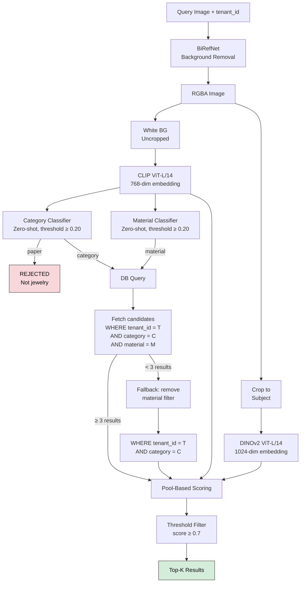
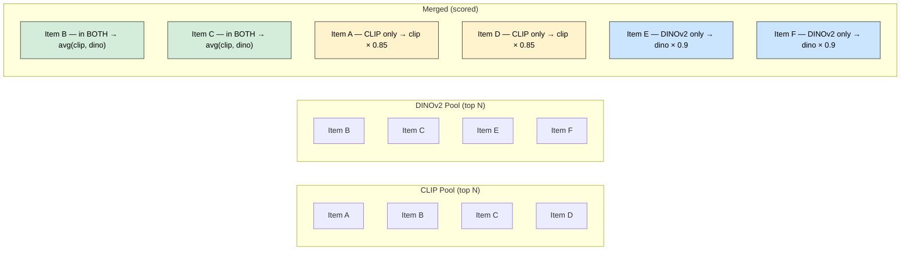
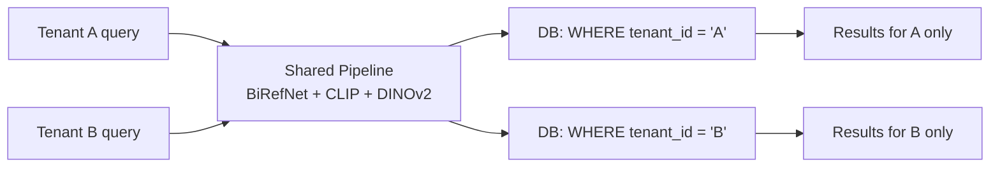

# Search Pipeline — Architecture & Scoring

## 1. Pipeline Overview

The search pipeline accepts a query image and a tenant identifier, then returns the top-K most similar products from that tenant's catalog. It uses a **pool-based** scoring approach where two models independently select their best candidates, which are then merged and ranked.

### Why pool-based instead of weighted combination?

A weighted combination (e.g., `0.4 × CLIP + 0.6 × DINOv2`) has two problems:

1. **One model can dominate.** If CLIP gives 0.95 to a wrong-material match and DINOv2 gives 0.60, the weighted score is 0.74 — still high enough to rank #1 despite DINOv2 flagging it as a poor visual match.
2. **Weights require tuning.** The optimal ratio changes per category, material, and dataset. Fixed weights are always a compromise.

Pool-based search solves both: each model independently selects its best candidates, and only items that **at least one model strongly endorses** make the final set. Items endorsed by **both** models are ranked highest.

## 2. Pipeline Flow



## 3. Pool-Based Scoring — Step by Step

### Step 1: Compute similarities independently

For each candidate `i` in the filtered set:

```
clip_score(i) = cosine_similarity(query_clip, candidate_clip[i])
dino_score(i) = cosine_similarity(query_dino, candidate_dino[i])
```

Where cosine similarity is:

```
                    A · B
cos(A, B) = ─────────────────
              ‖A‖ × ‖B‖
```

### Step 2: Select independent pools

```
CLIP_pool  = top N candidates by clip_score     (N = pool_size)
DINOv2_pool = top N candidates by dino_score    (N = pool_size)
```

Each pool contains up to `pool_size` candidates. They are selected independently — the pools may partially overlap or be completely disjoint.

### Step 3: Merge pools

```
merged = CLIP_pool ∪ DINOv2_pool          (union, up to 2N unique candidates)
overlap = CLIP_pool ∩ DINOv2_pool          (intersection)
```



### Step 4: Score each merged candidate

For each candidate `i` in the merged set:

```
If i ∈ CLIP_pool AND i ∈ DINOv2_pool:
    score(i) = (clip_score(i) + dino_score(i)) / 2
    pool_tag = "both"

If i ∈ DINOv2_pool ONLY:
    score(i) = dino_score(i) × penalty_dino
    pool_tag = "dino"

If i ∈ CLIP_pool ONLY:
    score(i) = clip_score(i) × penalty_clip
    pool_tag = "clip"
```

Default penalties:

| Pool membership | Score formula | Penalty | Rationale |
|---|---|---|---|
| Both pools | `(clip + dino) / 2` | None (1.0) | Both models agree → strongest signal |
| DINOv2 only | `dino × 0.9` | 10% | Design match but uncertain material/style |
| CLIP only | `clip × 0.85` | 15% | Material/style match but uncertain design |

DINOv2-only gets a lighter penalty because after category + material filtering, CLIP's job is largely done. Within the filtered set, visual design similarity (DINOv2) is the primary differentiator.

### Step 5: Threshold + Top-K

```
filtered = {i : score(i) ≥ threshold}       (default threshold = 0.7)
results  = top K of filtered, sorted by score descending
```

If fewer than K candidates pass the threshold, fewer than K results are returned. This is intentional — returning low-quality matches is worse than returning fewer results.

## 4. Scoring Examples

### Example A: Perfect match (in both pools)

```
Query: gold oval pendant with Ganesh motif

Candidate: gold oval pendant with deity motif
  clip_score = 0.89   (same material, same category)
  dino_score = 0.88   (same shape, same design density)
  pool: both
  score = (0.89 + 0.88) / 2 = 0.885   ✅ Above threshold
```

### Example B: Design match only (DINOv2 pool only)

```
Query: gold oval pendant with Ganesh motif

Candidate: silver oval pendant with deity motif
  clip_score = 0.71   (different material → not in CLIP top-N)
  dino_score = 0.86   (same shape, same design)
  pool: dino
  score = 0.86 × 0.9 = 0.774   ✅ Above threshold
```

### Example C: Material match only (CLIP pool only)

```
Query: gold oval pendant with Ganesh motif

Candidate: gold rectangular pendant, plain
  clip_score = 0.88   (same material, same category)
  dino_score = 0.35   (different shape, different design → not in DINOv2 top-N)
  pool: clip
  score = 0.88 × 0.85 = 0.748   ✅ Above threshold, but ranks lower
```

### Example D: Below threshold

```
Query: gold oval pendant with Ganesh motif

Candidate: gold chain, plain
  clip_score = 0.82   (same material)
  dino_score = 0.20   (completely different design)
  pool: clip (CLIP-only)
  score = 0.82 × 0.85 = 0.697   ❌ Below 0.7 threshold, excluded
```

## 5. Configuration Reference

All parameters are configurable via `config/config.yaml`:

```yaml
search:
  top_k: 10
  pool_size: 10
  final_threshold: 0.7
  use_category_filter: true
  use_material_filter: true
  material_confidence_threshold: 0.20
  category_confidence_threshold: 0.20
  dino_only_penalty: 0.9
  clip_only_penalty: 0.85
```

| Parameter | Default | Description |
|---|---|---|
| `top_k` | 10 | Maximum results returned |
| `pool_size` | 10 | Top-N candidates selected per model |
| `final_threshold` | 0.7 | Minimum score to include in results |
| `use_category_filter` | true | Filter candidates by predicted category |
| `use_material_filter` | true | Filter candidates by predicted material |
| `material_confidence_threshold` | 0.20 | Min confidence to apply material filter |
| `category_confidence_threshold` | 0.20 | Min confidence to accept category classification |
| `dino_only_penalty` | 0.9 | Penalty for DINOv2-only matches |
| `clip_only_penalty` | 0.85 | Penalty for CLIP-only matches |

## 6. Output Format

```json
{
  "results": [
    {
      "serial_number": "EGPN017274",
      "rank": 1,
      "score": 0.885,
      "clip_score": 0.89,
      "dino_score": 0.88,
      "pool": "both",
      "category": "pendant",
      "material": "gold"
    },
    {
      "serial_number": "EGPN017278",
      "rank": 2,
      "score": 0.774,
      "clip_score": 0.71,
      "dino_score": 0.86,
      "pool": "dino",
      "category": "pendant",
      "material": "silver"
    }
  ],
  "query_category": "pendant",
  "query_confidence": 0.284,
  "query_material": "gold",
  "material_confidence": 0.256,
  "n_candidates": 200,
  "pool_stats": {
    "clip_pool_size": 10,
    "dino_pool_size": 10,
    "merged_size": 16,
    "in_both": 4
  },
  "timing_ms": {
    "birefnet_ms": 301.2,
    "clip_ms": 41.5,
    "classify_ms": 0.2,
    "dinov2_ms": 39.8,
    "db_ms": 5.3,
    "search_ms": 0.4,
    "total_ms": 389.1
  }
}
```

## 7. Latency Breakdown

| Stage | Time (T4 GPU) | Notes |
|---|---|---|
| BiRefNet | ~300ms | Background removal at 1024×1024 |
| CLIP encode | ~40ms | 224×224 forward pass |
| Classify (cat + mat) | ~0.2ms | Two dot products against centroids |
| DINOv2 encode | ~40ms | 224×224 forward pass |
| DB fetch | ~5ms | pgvector with category + material index |
| Pool scoring | ~0.4ms | Two cosine similarities + merge logic |
| **Total** | **~385ms** | |

## 8. Multi-Tenant Isolation

Every DB query includes `WHERE tenant_id = ?`. A tenant's search never sees another tenant's products. The models and classifiers are shared (stateless) — no tenant-specific training or state.


